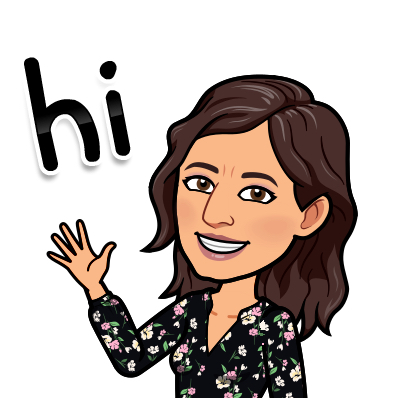

Hi, I'm Neha. I am an Electrical Engineer turned Data Scientist. I love tinkering with Data in Python. 

- 🔭 I’m currently spending my time applying for jobs and working on my portfolio.
- 🌱 I’m currently reading Python Machine Learning by Sebastian Raschka. Also learning Tableau. 
- 👯 I’m looking to collaborate on any Data Analytics project. 
- 🤔 I’m looking for help with jobs and volunteer opportunities.  I'm also looking to network with people in the field, especially folks who have transitioned to Data Science.
- 💬 Ask me about any beginner/intermediate level questions you might have about data science libraries in python.
- 📫 How to reach me: 

- 😄 Pronouns: she/her
- ⚡ Fun fact: My username is derived from the word <b>plasmon</b> which was my dissertation topic in grad school. 
- :cookie: Hobbies: I love to bake! My favorite is Scottish Shortbread cookies. They are so easy to make and yet so so so delicious.:yum:  I am also trying to learn Kashmiri (its one of the regional languages of India. Ask me why.:smiley:)

-->
<!--
**plasmagirl/plasmagirl** is a ✨ _special_ ✨ repository because its `README.md` (this file) appears on your GitHub profile.

Here are some ideas to get you started:

- 🔭 I’m currently spending my time applying for jobs and working on my portfolio.
- 🌱 I’m currently reading Python Machine Learning by Sebastian Raschka and I plan to blog about it to keep myself motivated and accountable.
- 👯 I’m looking to collaborate on ...
- 🤔 I’m looking for help with jobs and volunteer opportunities. 
- 💬 Ask me about ...
- 📫 How to reach me: ...
- 😄 Pronouns: she/her
- ⚡ Fun fact: 
-->
